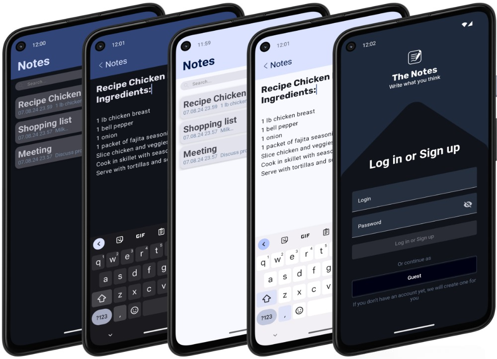

# TheNotes

  

  

## Technology stack

- Android SDK
- Kotlin
- MVVM
- ViewModel
- Jetpack Compose
- Compose Navigation
- LiveData
- Kotlin Coroutines
- Room (SQLite)
- Firebase SDK
- Git

## Features

A few things you can do with TheNotes:

- Create a private account using your email and password so all your notes are stored in the cloud.
- Log in as a guest and store notes in your device's memory.
- View the notes you have created.
- Create notes.
- Edit notes.
- Delete notes.
- Search through notes.
